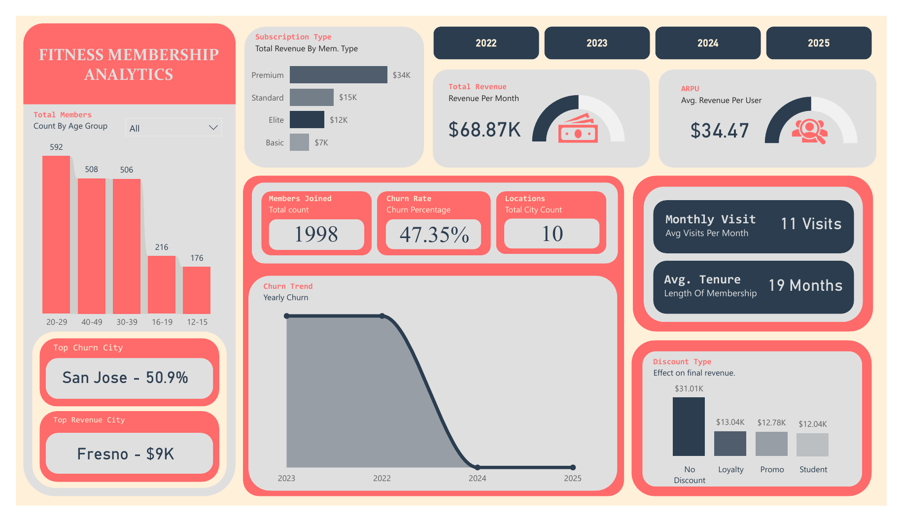

# Fitness Membership Analytics Report  

---

## Executive Summary  
This project was designed to address a critical business challenge:  
**High churn rates and revenue leakage in California fitness centers.**  

Using **Python preprocessing** and a **Power BI dashboard**, I transformed raw membership data into insights that directly answer:  
- Why are members leaving?  
- Which cities are most at risk?  
- How do discounts impact revenue?  

The findings provide a focused roadmap for improving **retention strategies** and **revenue optimization**.  

---

## Problem Statement  
Fitness centers in California face:  
- Nearly **half of members leaving within 2 years (47% churn)**.  
- **San Jose** leading in churn despite large membership numbers.  
- Heavy use of discounts reducing long-term profitability.  

The goal was to **pinpoint the direct link between churn and revenue** so stakeholders can act quickly.  

---

## Data & Methodology  
- **Tools:** Python (data wrangling, churn labeling, feature engineering), Power BI (dashboard visualization).  
- **Steps Taken in Python:**  
  - Cleaned missing values.  
  - Engineered features: **tenure months, churn flag, adjusted price, discount impact**.  
  - Prepared structured dataset for visualization.  

- **Visualization:** A focused dashboard showing **churn by city, revenue by city, and discount effect on revenue**.  

### 📂 Project Files  
- 📘 [Python Notebook](preprocessing.ipynb) 
- 📊 [Dataset (Excel/CSV)](Fitness_Membership_Dataset.xlsx)

---

## Key Insights  

### Churn & Retention  
- **Overall Churn Rate:** 47.35%.  
- **San Jose:** Highest churn (50.9%), critical retention risk.  
- **Tenure:** Average member stays ~19 months before leaving.  

### 📈 Revenue Impact  
- **Monthly Revenue:** $68.87K.  
- **Top City:** Fresno generates the most revenue ($9K), a model for growth.  

### Discount Effect  
- Members **without discounts** generated the **highest revenue ($31.01K)**.  
- Heavy **promo/student discounts** reduced overall profitability despite higher sign-ups.  

---

## Business Impact  
- **High churn = revenue loss.** Replacing members is costly and unsustainable.  
- **Discount overuse erodes margins.** Loyalty-based incentives are more effective than blanket promotions.  
- **City-specific strategy is needed.** Fresno’s growth path can be replicated, while San Jose requires urgent retention focus.  

---

## Recommendations  
1. **Retention Programs in San Jose**  
   - Design loyalty/tenure-based rewards to reduce early exits.  
   - Offer personalized services (group classes, PT sessions) for at-risk members.  

2. **Refine Discount Strategy**  
   - Limit promo/student discounts.  
   - Focus on **loyalty discounts** that encourage long-term retention.  

3. **Revenue Growth Playbook**  
   - Study Fresno’s model and replicate in other cities.  
   - Strengthen Elite subscription offerings with premium add-ons.  

---

## Conclusion  
This project shows that **churn and discount misuse are the biggest risks** to fitness center profitability in California.  

By focusing on **retention and smarter discounting**, stakeholders can:  
- Improve member lifetime value (LTV),  
- Reduce revenue leakage,  
- Build a more sustainable growth model.  

---
## 📊 Dashboard Preview  

Here’s the snapshot of the Power BI dashboard that visualizes the insights from this project:

📌 *Prepared using Python preprocessing (`gym.ipynb`) and Power BI dashboard visualizations.*  
